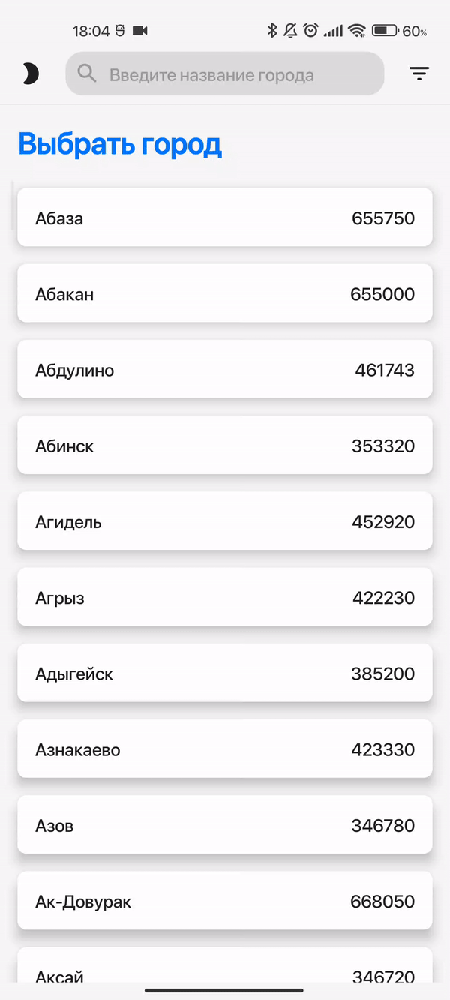
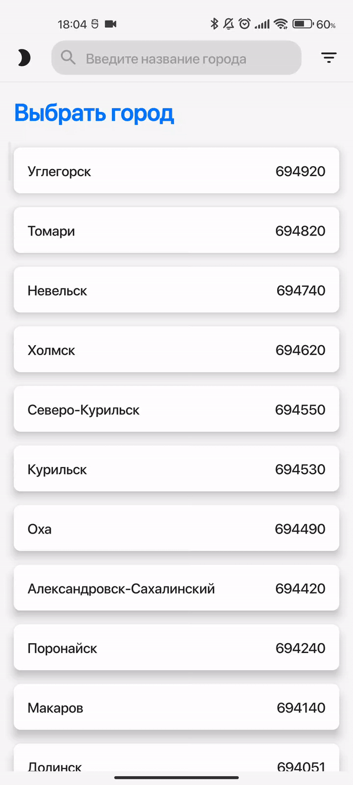

# Elmaks
Приложение по поиску городов России.
>Главная задача проекта -> Показать пример Android приложения на Jetpack Compose с архитектурным подходом "The Elm Architecture" (TEA).
# Используемые технологии:
* Модульный проект. 🔠
* Like TEA подход к организации UI слоя. 🔭🌌🌠🪐✨
* Чистая архитектура. 🙈
* Jetpack Compose. 🤖
* Coroutines Flow. ♨️
* Dagger Hilt. 🗡️
* Json, Kotlin Serialization. 📃
* Room, Compose DataStore. 💽
* Compose Navigation. 🗺️

Список городов предоставлен сервисом [DaData](https://dadata.ru/opendata)
***
Основные фичи:
* Поиск города по названию.
* Возможность сортировки списка.
* Изменение цвета темы оформления (DarkMode, LightMode)

  
  
  

